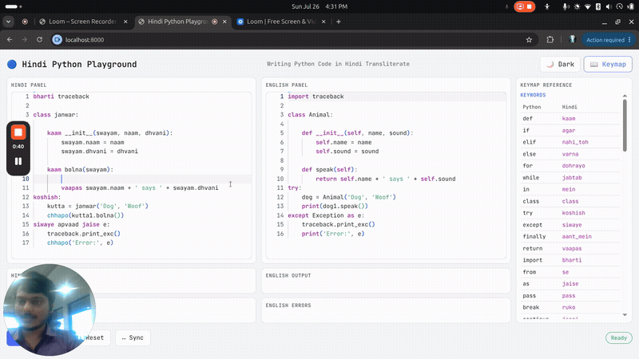

# Hindi Python Playground

Write Python using Hindi words typed in the English alphabet (transliteration) —
`kaam`, `agar`, `chhapo`, `vaapas` — instead of English keywords. Built for people
who can type English letters but find English keywords and error messages hard
to follow.



## How it works

Your transliterated-Hindi code is parsed into a Python AST, then a reverse-map
(Hindi → English identifiers/keywords) is applied to rebuild valid English
Python underneath. That English AST is executed, and both output **and
errors** are translated back into Hindi — so you don't just write Hindi, you
also get Hindi output and Hindi errors instead of an English traceback.

## Run it

```bash
uv sync
cp .env.example .env   # add your SARVAM_API key
uv run uvicorn backend.app:create_app --factory --reload --port 8000
```

Open `http://localhost:8000` and start typing in the Hindi panel — the
English panel stays in sync live.
